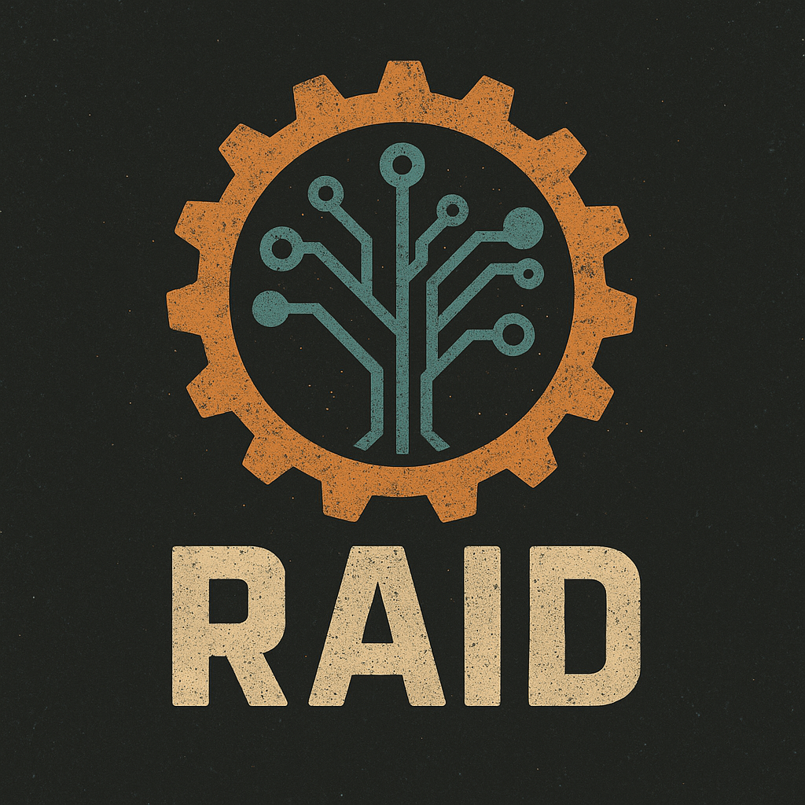

<div align="center">



# RAID - Rust Analysis and Informative Debugger

RAID (Rust Analysis and Informative Debugger) is a comprehensive system health checker that leverages AI to analyze your system for potential issues, security concerns, and performance problems.

</div>

## ⚠️ Project Status Warning

**This project is currently "vibe coded"** - meaning it was built quickly with a focus on getting things working rather than production-quality polish. While it functions and can be useful, please understand that there may be more bugs than you'd typically expect from a finished project.

If people find this tool useful and there's community interest, we may invest more effort into making it more robust and production-ready in the future. For now, please use it with the understanding that it's more of a proof-of-concept/experimental tool.

We know this is hard to believe, but yes, there really might be more bugs than usual! 😅

## Important Rules

### NEVER source ~/.chatgpt file
- The application should NEVER attempt to read, parse, or source the `~/.chatgpt` file
- API keys must be provided via environment variables or command line arguments only
- This is a security and design principle - the application should not make assumptions about user file structures

## Features

- **Multi-AI Provider Support**: OpenAI, Anthropic, and Local models
- **Comprehensive System Analysis**: Kubernetes, containers, systemd, journal, cgroups
- **Historical Data Storage**: SQLite database for tracking changes over time
- **Modular Architecture**: Easy to extend with new AI providers and system checks
- **Async Operations**: Fast, non-blocking AI analysis
- **Flexible Configuration**: Support for both environment variables and command line arguments
- **Clean CLI**: Built with clap derive for excellent user experience
- **Smart Defaults**: Pre-configured with optimal models for immediate use

## Quick Start

Just provide your OpenAI API key and you're ready to go!

```bash
# Set your API key
export AI_API_KEY=your_openai_api_key

# Run a full system check (uses GPT-4o-mini by default)
cargo run

# Or check specific components
cargo run -- check system
cargo run -- check containers
```

## Installation

```bash
cargo install --path .
```

## Configuration

The tool supports both environment variables and command line arguments for AI configuration. Command line arguments take precedence over environment variables.

### Default Models

- **OpenAI**: `gpt-4o-mini` (fast, cost-effective, powerful)
- **Anthropic**: `claude-3-5-sonnet-20241022` (latest Claude model)
- **Local**: `llama2` (for Ollama users)

### Command Line Options

```bash
# Global AI options (can be used with any subcommand)
-p, --ai-provider <PROVIDER>     AI provider to use (open-ai, anthropic, local) [default: open-ai]
-k, --ai-api-key <KEY>           API key for the AI provider
-m, --ai-model <MODEL>           AI model to use
    --ai-base-url <URL>          Base URL for AI provider (for custom endpoints)
    --ai-max-tokens <TOKENS>     Maximum tokens for AI response
    --ai-temperature <TEMP>      Temperature for AI response (0.0-1.0)
    --dry-run                    Run without AI analysis (just collect and display system info)
```

### Environment Variables

#### OpenAI (Default)
```bash
export AI_PROVIDER=open-ai  # Optional, this is the default
export AI_API_KEY=your_openai_api_key
export AI_MODEL=gpt-4o-mini  # Optional, this is the default
export AI_MAX_TOKENS=1000
export AI_TEMPERATURE=0.7
```

#### Anthropic
```bash
export AI_PROVIDER=anthropic
export AI_API_KEY=your_anthropic_api_key
export AI_MODEL=claude-3-5-sonnet-20241022  # Optional, this is the default
export AI_MAX_TOKENS=1000
export AI_TEMPERATURE=0.7
```

#### Local Models (Ollama)
```bash
export AI_PROVIDER=local
export AI_MODEL=llama2  # Optional, this is the default
export AI_BASE_URL=http://localhost:11434
export AI_MAX_TOKENS=1000
export AI_TEMPERATURE=0.7
```

### Custom Base URLs
For self-hosted or custom endpoints:
```bash
export AI_BASE_URL=https://your-custom-endpoint.com
```

## Usage

### Check Everything (Default)
```bash
cargo run
# or
cargo run -- check all
```

### Check with AI Configuration

```bash
# Using command line arguments
cargo run -- --ai-provider open-ai --ai-api-key your_key check all

# Using environment variables (recommended for production)
export AI_API_KEY=your_key
cargo run -- check all

# Mix of both (command line takes precedence)
export AI_PROVIDER=anthropic
cargo run -- --ai-provider open-ai --ai-api-key your_key check system

# Local model with custom settings
cargo run -- --ai-provider local --ai-model llama2 --ai-temperature 0.8 check containers
```

### Dry Run Mode (No AI Analysis)

Perfect for testing system information collection without making expensive AI API calls:

```bash
# Check everything without AI analysis
cargo run -- --dry-run

# Check specific components without AI analysis
cargo run -- --dry-run check system
cargo run -- --dry-run check containers
cargo run -- --dry-run check kubernetes
cargo run -- --dry-run check cgroups
cargo run -- --dry-run check systemd
cargo run -- --dry-run check journal

# Combine with other options (AI options are ignored in dry-run mode)
cargo run -- --dry-run --ai-provider open-ai --ai-api-key your_key check system
```

**Benefits of Dry Run Mode:**
- ✅ No API costs - perfect for testing and development
- ✅ Fast execution - no network calls to AI providers
- ✅ Full system information collection
- ✅ Same output format (without AI analysis section)
- ✅ Great for debugging system information collection

### Check Specific Components

```bash
# Basic system information
cargo run -- check system

# Container information with OpenAI (uses GPT-4o-mini by default)
cargo run -- --ai-api-key your_key check containers

# Kubernetes environment with Anthropic
cargo run -- --ai-provider anthropic --ai-api-key your_key check kubernetes

# Cgroup configuration with local model
cargo run -- --ai-provider local --ai-model llama2 check cgroups

# Systemd services
cargo run -- check systemd

# System journal
cargo run -- check journal
```

### Help and Information

```bash
# Show help
cargo run -- --help

# Show help for check subcommand
cargo run -- check --help

# Show version
cargo run -- --version
```

## What Gets Collected

### System Information
- Operating system and CPU details
- Basic hardware information

### Kubernetes Information
- Namespace, pod name, node name
- Service account details
- Kubernetes environment detection

### Container Information
- Docker containers (if available)
- Containerd containers (if available)
- Container status, images, and ports

### Cgroup Information
- Cgroup version (v1/v2)
- Memory and CPU limits
- Cgroup controllers and paths

### Systemd Information
- System status
- Failed units
- Important service status (docker, containerd, kubelet, etc.)

### Journal Information
- Recent errors and warnings
- Boot errors
- System log analysis

## Database

The tool stores all comprehensive checks in a SQLite database (`system_checks.db`) for historical analysis. Only the "all" command stores data in the database.

## Architecture

The tool is built with a modular architecture:

- **CLI Module** (`src/cli.rs`): Command line interface using clap derive
- **AI Module** (`src/ai.rs`): Abstract AI provider interface
- **System Info Module** (`src/sysinfo.rs`): System information collection
- **Database Module** (`src/database.rs`): Data persistence
- **UI Module** (`src/ui.rs`): Output formatting

## Extending the Tool

### Adding New AI Providers

Implement the `AIProvider` trait:

```rust
#[async_trait]
impl AIProvider for YourProvider {
    async fn analyze(&self, input: &str) -> Result<String, AIError> {
        // Your implementation
    }

    fn name(&self) -> &str {
        "YourProvider"
    }
}
```

### Adding New System Checks

Extend the `SystemInfo` struct and add collection functions in `sysinfo.rs`.

### Adding New Subcommands

Add new variants to the `Commands` enum in `cli.rs` and handle them in the main function.

## Error Handling

The tool gracefully handles:
- Missing AI API keys (falls back to DummyAI)
- Network connectivity issues
- Missing system tools (docker, systemctl, etc.)
- Database errors

## Examples

### Basic Usage
```bash
# Check everything with OpenAI (GPT-4o-mini)
export AI_API_KEY=your_key
cargo run

# Or using command line arguments
cargo run -- --ai-api-key your_key
```

### Dry Run Testing
```bash
# Test system information collection without AI costs
cargo run -- --dry-run

# Test specific components
cargo run -- --dry-run check system
cargo run -- --dry-run check containers
```

### Container-Focused Check
```bash
# Only check containers with specific model
cargo run -- --ai-api-key your_key --ai-model gpt-4 check containers
```

### Local Model Usage
```bash
# Use local Ollama model
cargo run -- --ai-provider local --ai-model llama2 check systemd
```

### Custom Endpoint
```bash
# Use custom OpenAI-compatible endpoint
cargo run -- --ai-api-key your_key --ai-base-url https://your-endpoint.com check all
```

## Troubleshooting

### AI Provider Issues
- Check your API keys are set correctly
- Verify network connectivity
- For local models, ensure Ollama is running
- Use `--ai-provider local` for testing without API keys

### Permission Issues
- Some checks require root access (systemd, journal)
- Run with `sudo` if needed for full system access

### Missing Tools
- Install Docker for container checks
- Install systemd for service checks
- Install journalctl for log analysis

## Contributing

1. Fork the repository
2. Create a feature branch
3. Add your changes
4. Add tests if applicable
5. Submit a pull request

## License

MIT License - see LICENSE file for details. 

## AI Agent Mode (New!)

RAID now supports an advanced **AI Agent Mode** that allows the AI to iteratively call diagnostic tools and make multiple rounds of analysis to solve complex problems.

### Key Features

- **Iterative Problem Solving**: The AI can call multiple diagnostic tools in sequence
- **Configurable Tool Limits**: Set maximum number of tool calls (default: 50)
- **Pause and Continue**: AI can pause to ask for user clarification
- **Interactive Sessions**: Continue analysis after hitting limits
- **Comprehensive Logging**: Track all tool calls and decisions

### Usage

#### Basic AI Agent Mode

```bash
# Enable AI agent mode for complex problem solving
cargo run -- "my pod is stuck in crash loop backoff" --ai-agent-mode

# With custom tool call limit
cargo run -- "system is running slow" --ai-agent-mode --ai-max-tool-calls 100

# With specific AI provider
cargo run -- "kubernetes deployment failing" --ai-agent-mode --ai-provider anthropic
```

#### Example Session

```
🤖 AI Agent Mode - Iterative Problem Solving
Problem: my pod is stuck in crash loop backoff
Max tool calls: 50
Starting analysis...

🔄 AI Agent is calling diagnostic tools...

🔧 Tool 1/50: kubectl_get_pods --namespace default
✅ Found pod in CrashLoopBackOff state

🔧 Tool 2/50: kubectl_describe_pod my-pod --namespace default
✅ Found exit code 1, checking logs...

🔧 Tool 3/50: kubectl_logs my-pod --namespace default --lines 50
✅ Found connection refused error

🔧 Tool 4/50: kubectl_get_services --namespace default
✅ Service configuration looks correct

🎯 Final Analysis (after 4 tool calls):
The pod is failing because it cannot connect to the database service. 
The connection is being refused, indicating either:
1. Database service is not running
2. Wrong service name in pod configuration
3. Network policy blocking connection

Recommended next steps:
- Check if database pod is running: kubectl get pods | grep database
- Verify service endpoints: kubectl get endpoints
- Check pod environment variables for correct service names
```

#### Interactive Features

When the AI needs more information:
```
⏸️  AI Agent paused after 15 tool calls
Reason: I need more information about your database configuration.

Your response (or 'quit' to exit): The database is running in namespace "database"

🔄 Continuing analysis with additional context...
```

When hitting tool call limits:
```
⚠️  Tool call limit reached after 50 calls
Partial analysis: Found multiple potential issues with networking configuration...

Continue with 50 more tool calls? (y/n): y
Continuing with 50 more tool calls...
```

### Configuration Options

| Option | Environment Variable | Default | Description |
|--------|---------------------|---------|-------------|
| `--ai-agent-mode` | - | false | Enable iterative AI agent mode |
| `--ai-max-tool-calls` | `AI_MAX_TOOL_CALLS` | 50 | Maximum tool calls per session |
| `--ai-provider` | `AI_PROVIDER` | openai | AI provider (openai, anthropic, local) |
| `--ai-api-key` | `AI_API_KEY` | - | API key for AI provider |
| `--ai-model` | `AI_MODEL` | auto | Specific model to use |

### Comparison: Standard vs Agent Mode

| Feature | Standard Mode | AI Agent Mode |
|---------|---------------|---------------|
| Tool calls | Single analysis | Multiple iterative calls |
| Interaction | One-shot | Interactive with pauses |
| Problem solving | Basic | Advanced multi-step |
| Tool selection | Pre-defined | AI-driven selection |
| Continuation | No | Yes, after limits/questions |

### Best Use Cases

**Standard Mode** is best for:
- Quick system health checks
- Simple diagnostic questions
- Automated health monitoring
- Batch processing

**AI Agent Mode** is best for:
- Complex troubleshooting scenarios
- Multi-component system issues
- Interactive debugging sessions
- Learning system investigation techniques

### Environment Variables

Set these for consistent AI agent behavior:

```bash
export AI_PROVIDER=anthropic
export AI_API_KEY=your-api-key-here
export AI_MAX_TOOL_CALLS=75
export AI_MODEL=claude-3-5-sonnet-20241022
```

### Advanced Examples

**Kubernetes Troubleshooting**:
```bash
cargo run -- "deployment is failing with ImagePullBackOff" --ai-agent-mode --ai-max-tool-calls 30
```

**Performance Investigation**:
```bash
cargo run -- "system is slow and users are complaining" --ai-agent-mode --verbose
```

**Network Debugging**:
```bash
cargo run -- "pods cannot reach external services" --ai-agent-mode --ai-provider anthropic
``` 